<div align="center">

# Питомец Финни

**Игра о финансовой грамотности для детей 7–11 лет**<br>
по техническому заданию №6 Департамента финансов города Москвы


<a href="https://github.com/egor-ver/finny-pet/releases/latest"></a>

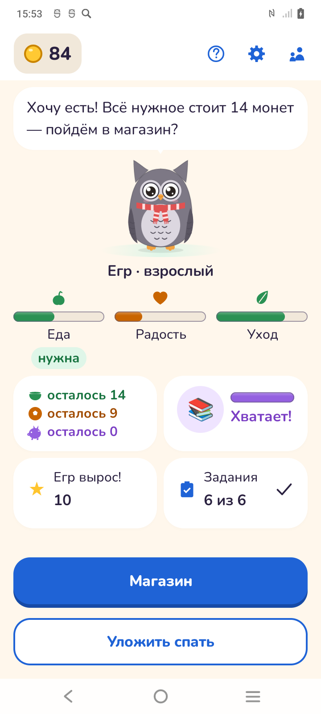&nbsp;
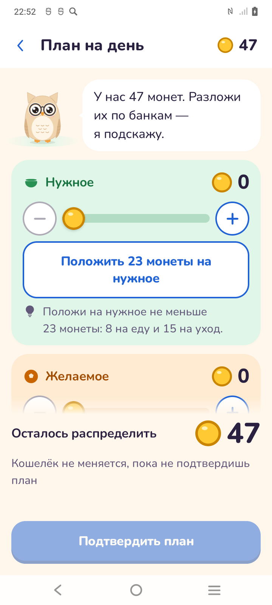&nbsp;
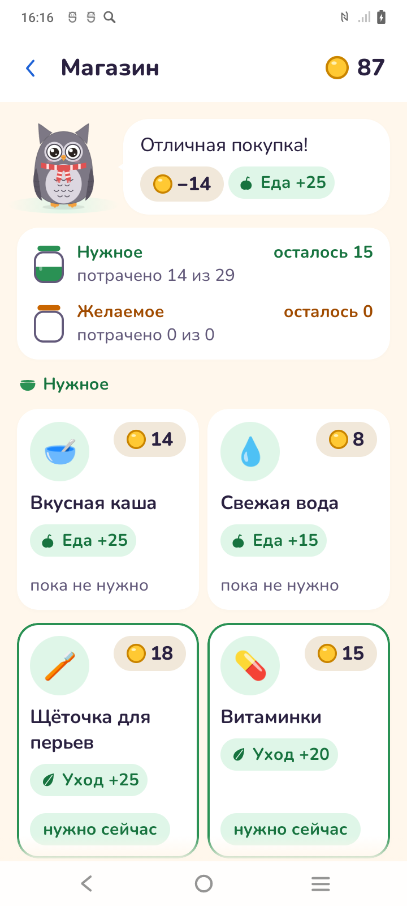

</div>

## 🦉 Об игре

Ребёнок заводит совёнка и каждый игровой день получает монеты. До покупок он
раскладывает их на три банки — «Нужное», «Желаемое» и «Копилка», — а потом
кормит сову, покупает радости и копит на цель. Вечером итоги дня показывают,
что стало с питомцем и почему он вырос или нет.

Реальных денег, платежей, рекламы и сбора персональных данных нет: монеты
игровые, вместо имени ребёнок придумывает игровое, приложение работает без сети.

## Как играть

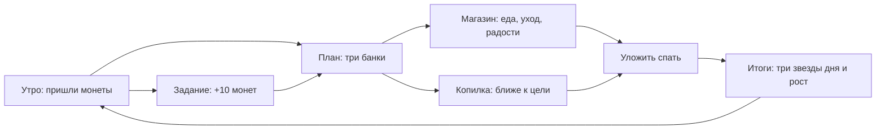

| Шаг | Что делает ребёнок | Чему учит |
|---|---|---|
| Задание | Решает денежную задачку, получает объяснение любого ответа | Запас, список покупок, соблазн «только сегодня» |
| План | Раскладывает монеты кошелька по трём банкам | Сначала нужное, потом желаемое и копилка |
| Покупки и копилка | Покупает в магазине, откладывает на цель | План против факта, цена спонтанной покупки |
| Итоги | Видит звёзды «Сыт», «По плану», «Отложил» | Последствия решений; совёнок растёт в три стадии |

Первый запуск проводит через обучение из 7 шагов с совой и стрелками;
кнопка «?» на главном открывает его снова.

## Экраны

| | | |
|:-:|:-:|:-:|
| 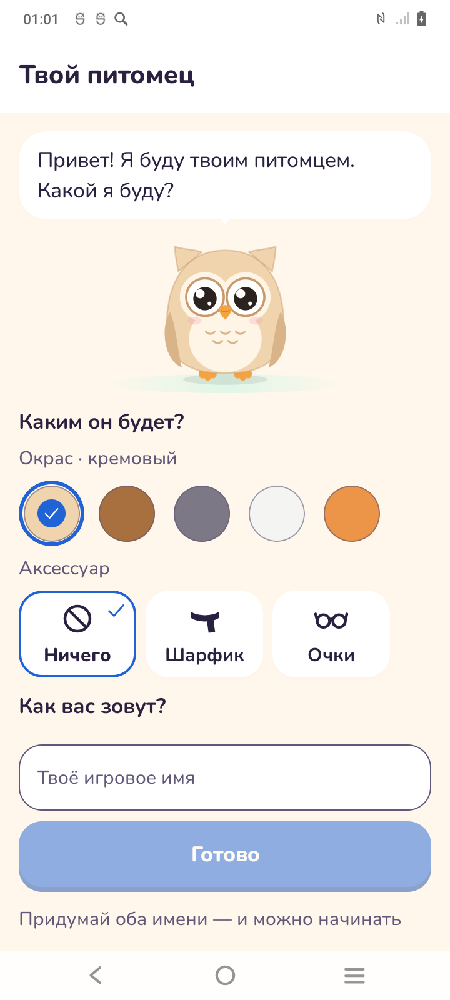 |  | 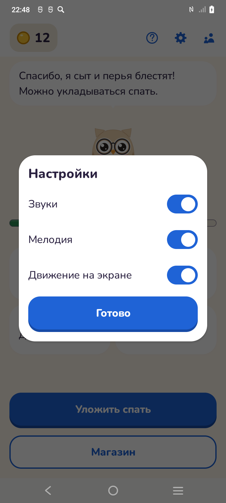 |
| Создание: окрас, аксессуар, имена | Главный: сова, показатели, план, цель | Настройки: звуки, мелодия, движение |
|  |  | 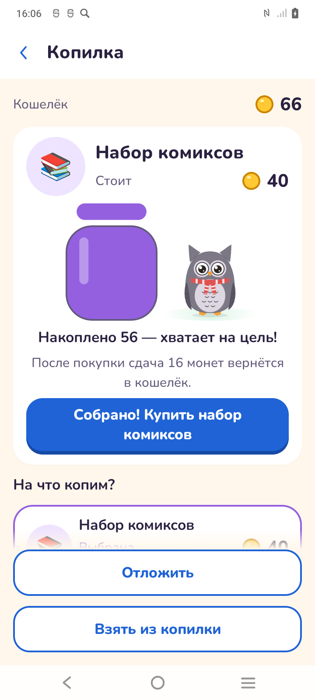 |
| План: монеты по трём банкам | Магазин: «потрачено 0 из 23» | Копилка: накоплено 28 из 70 |
| 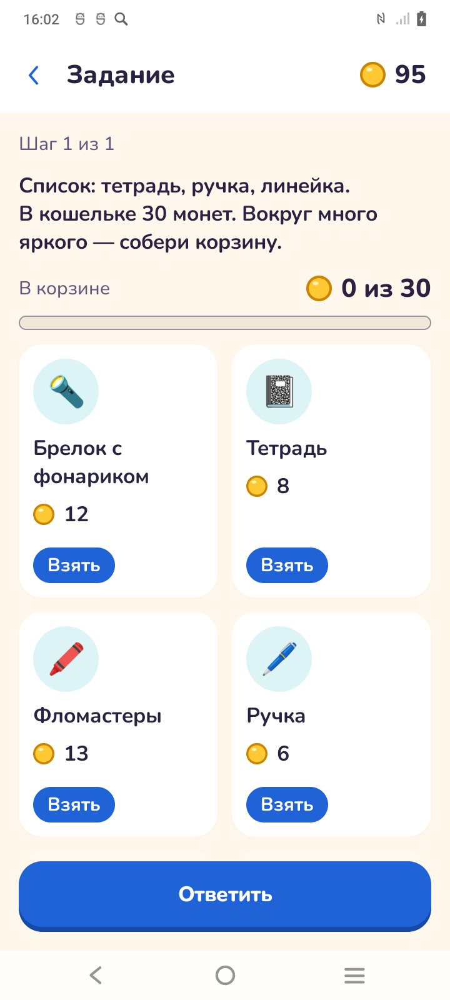 | 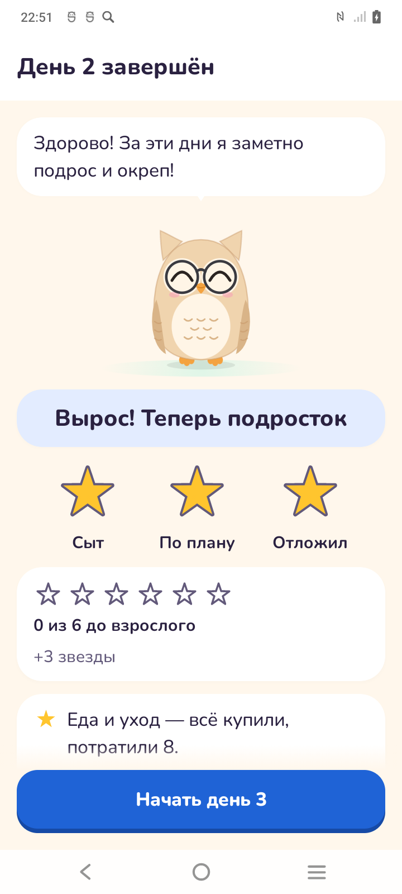 | 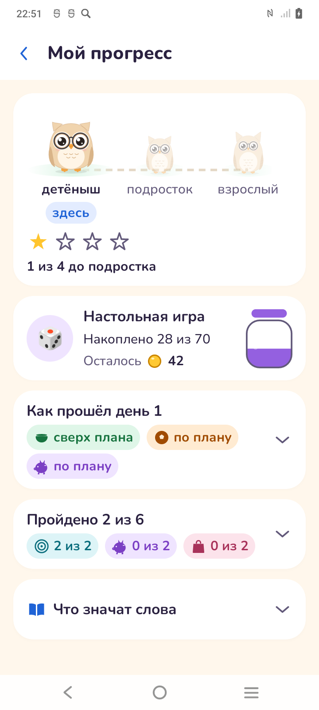 |
| Задание: копим на воздушного змея | Итоги дня: звёзды и рост | «Мой прогресс»: стадии, цель, словарик |
| 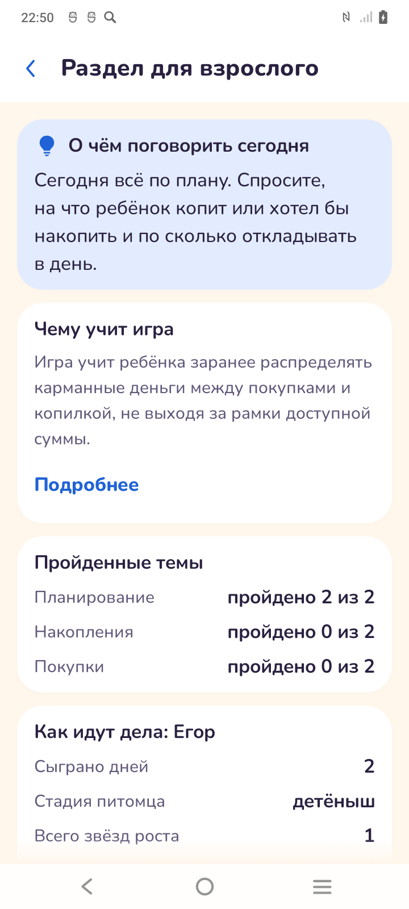 | | |
| Раздел взрослого: темы и советы | | |

Снимки с телефона Vivo (720×1600, ширина 384 dp). Окно настроек открывается
шестерёнкой рядом с «?» на главном; «?» заново запускает обучение.

## Статус на 29.09

**Готово:** весь игровой цикл по ТЗ 2.5 на настоящих данных, минимальный контент
ТЗ 2.6, release-APK. **Тесты:** 837 юнит-тестов, все проходят (`testDebugUnitTest`
на этом коммите).

### Функциональные требования (ТЗ 2.5)

| № | Требование | Статус | Что есть |
|---|---|---|---|
| 2.5.1 | Первый запуск, локальный профиль | ✅ | профиль без регистрации, обучение из 7 шагов, повтор по «?»; после перезапуска игра открывается на главном |
| 2.5.2 | Создание питомца | ✅ | окрас и аксессуар из контент-пака, игровые имена |
| 2.5.3 | Главный экран | ✅ | сова с репликой, кошелёк, показатели, план дня, цель, рост, задания; одно следующее действие внизу |
| 2.5.4 | Валюта и доход | ✅ | доход при открытии дня, награда за задание отдельной операцией, остаток переходит на завтра |
| 2.5.5 | Планирование бюджета | ✅ | три банки ползунками и «−/+», контроль остатка, подсказка «на нужное — не меньше N», план до покупок |
| 2.5.6 | Покупки | ✅ | цена, направление, влияние на сову; подтверждение, списание, объяснение нехватки; «потрачено N из M» по банкам |
| 2.5.7 | Накопления и цель | ✅ | три цели, накоплено и срок, пополнение и снятие с подтверждением, покупка собранной цели со сдачей |
| 2.5.8 | Финансовые задания | ✅ | 6 заданий по 3 темам (планирование, накопления, покупки) + разбор ошибки; вопросы с выбором, три банки, корзина; монеты за одно задание в день |
| 2.5.9 | Последствия и обратная связь | ✅ | операция, сова, копилка и прогресс меняются вместе; каждое действие объясняется словами с числами; реакция совы, звуки |
| 2.5.10 | Прогресс питомца | ✅ | три стадии, звёзды дня «Сыт», «По плану», «Отложил» |
| 2.5.11 | История и учебный прогресс | ✅ | «Мой прогресс»: как прошёл день, цель, пройденные задания, словарик |
| 2.5.12 | Раздел для взрослого | ✅ | вход через пример; чему учит игра, темы «N из M», о чём поговорить, монеты за дело вне игры, удаление игры |
| 2.5.13 | Сохранение и демо-режим | ✅ | Room, данные переживают перезапуск; демо в отдельном профиле, «Прожить день» настоящими правилами |
| 2.5.14 | Управление контентом | ✅ | тексты, товары, цели, задания и числа экономики — JSON в `assets`, правка без изменения кода |

### Демонстрационный контент (ТЗ 2.6)

| Элемент | Минимум | Сейчас |
|---|---|---|
| Стадии питомца | 3 | 3 — детёныш, подросток, взрослый |
| Комбинации внешности | 9 | 15 — 5 окрасов × (2 аксессуара + без аксессуара) |
| Товары | 8 | 8 — 4 нужных, 4 желаемых |
| Цели накопления | 3 | 3 |
| Задания по 3 темам | 6 | 6, по два на тему |
| Игровые периоды | 5 | 5 — в демо-режиме пять нажатий «Прожить день» доводят сову до последней стадии, закреплено тестом |

### Программно-аппаратные требования (ТЗ 3)

| № | Требование | Статус | Комментарий |
|---|---|---|---|
| 3.1 | Android 8.0+, портрет, от 360 dp | ✅ | minSdk 26, портрет; игра проходится на Vivo (384 dp); весь маршрут (создание, главный, план, магазин, задание, копилка, итоги и конец дня, раздел взрослого, настройки) проверен на 360 dp при шрифте ×1,0 и ×2,0 — слова целые, ничего не уходит под кнопки |
| 3.2 | Стек, контент отдельно от интерфейса | ✅ | Kotlin, Compose, Room; учебный контент в JSON |
| 3.3 | Имя пакета | ✅ | `ru.finnypet.app` |
| 3.3 | Подписанный APK, карточка RuStore | 🟡 | release подписан отладочным ключом; свой ключ и карточка RuStore — к финалу |
| 3.4 | Слои, надёжность, без секретов | ✅ | домен без Android, 837 юнит-тестов, секретов в репозитории нет |
| 3.5 | Без аккаунта и персональных данных | ✅ | нет сети, разрешений и облака; взрослый удаляет игру сам |
| 3.6 | UX/UI и доступность | ✅ | кнопки от 48 dp, текст от 16 sp, описания для TalkBack, отключение звука, мелодии и движения; 242 инструментальных теста (androidTest) зелёные на Vivo; весь маршрут проверен на 360 dp при шрифте ×1,0 и ×2,0 и пройден с TalkBack вживую |

### План до финала

| Что | Зачем |
|---|---|
| Свой ключ подписи | ТЗ 3.3 |
| Карточка RuStore | ТЗ 3.3 |

## Стек и запуск

| Компонент | Выбор | Версия |
|---|---|---|
| Язык | Kotlin | 2.2.10 |
| UI | Jetpack Compose (BOM) | 2026.02.01 |
| Внедрение зависимостей | Hilt | 2.60.1 |
| Хранилище | Room · DataStore Preferences | 2.8.5 · 1.2.1 |
| Переходы | Navigation Compose | 2.9.0 |
| Контент | kotlinx.serialization | 1.7.3 |
| Сборка | AGP / Gradle | 9.2.1 / 9.5.0 |

Версия приложения — `1.0` (`versionCode 1`, `app/build.gradle.kts`).
Сервера нет, игра полностью офлайн; ИИ и машинное обучение не применяются.

**Готовый APK:** [последний релиз](https://github.com/egor-ver/finny-pet/releases/latest) или сборка по инструкции ниже.

Нужны Android SDK с платформой **android-37.1** и JDK 21 (Gradle подтянет его сам
или возьмёт JBR из Android Studio **2026.1.1+**).

```bash
git clone https://github.com/egor-ver/finny-pet.git
cd finny-pet
./gradlew :app:assembleRelease    # app/build/outputs/apk/release/app-release.apk
./gradlew :app:testDebugUnitTest  # юнит-тесты
```

Release-сборка подписана отладочным ключом Android — её можно сразу поставить
на телефон. Для отладки — `./gradlew :app:installDebug`.

<details>
<summary>Особенности сборки</summary>

- **`local.properties`** не хранится в репозитории: Android Studio создаёт его
  сама, без IDE укажите путь к SDK или переменную `ANDROID_HOME`.
- **`android.disallowKotlinSourceSets=false`.** AGP 9 запрещает регистрировать
  исходники через `kotlin.sourceSets`, а KSP ещё пользуется этим для
  сгенерированного кода. Флаг уберём, когда KSP перейдёт на `android.sourceSets`.
- **`compileSdk = 37.1` при `targetSdk = 36`.** Шесть зависимостей androidx
  требуют компиляции против API 37; поведение приложения меняет только `targetSdk`.
- **R8 не включён:** сжатие кода — только при доказанной пользе.
- Инструментальные тесты (хранилище, экраны, доступность) —
  `./gradlew :app:connectedDebugAndroidTest`, нужен телефон или эмулятор.

</details>

## Архитектура кратко

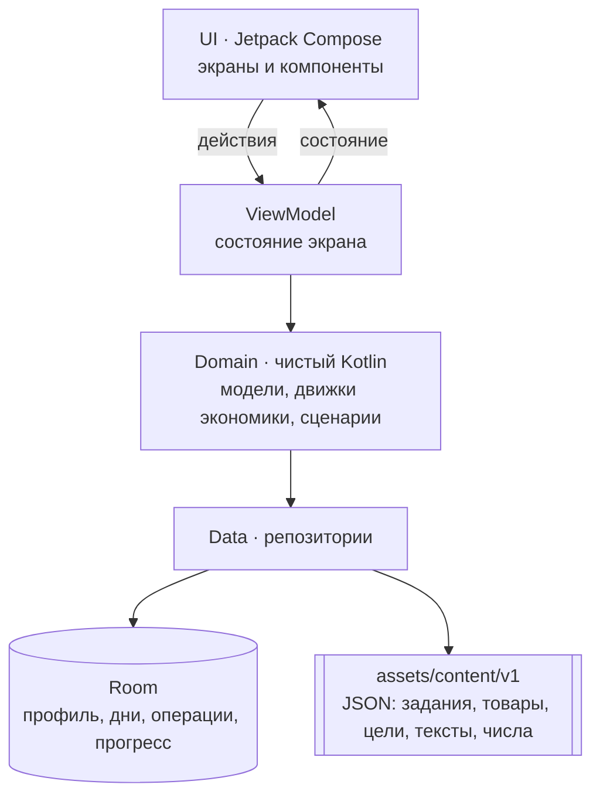

Один модуль `app`, слои разделены пакетами; домен не импортирует Android.
Изменяемое состояние игрока живёт в Room, учебный контент только читается из
[контент-пака](app/src/main/assets/content/v1/README.md) — так контент отделён от
кода (ТЗ 3.2) и правится без пересборки логики (ТЗ 2.5.14).

**Данные.** Room хранит профиль, питомца, игровые дни, план, операции кошелька,
копилку и пройденные задания; покупка или перевод пишутся одной транзакцией.
Итоги дня не хранятся, а пересчитываются из плана и операций. Настройки звука
и движения — в DataStore.

Решения и причины — [docs/ARCHITECTURE_DECISIONS.md](docs/ARCHITECTURE_DECISIONS.md).

<details>
<summary>Структура репозитория</summary>

```
app/
  src/main/java/ru/finnypet/app/
    domain/        модели, движки экономики, сценарии — без androidx
    data/          Room, репозитории, чтение контент-пака, DataStore
    ui/            экраны, дизайн-система, навигация, тексты с числами
    di/            модули Hilt
  src/main/assets/content/v1/   контент-пак: JSON и описание полей
  src/main/res/    строки, шрифт Nunito, звуки, иконка
  src/test/        юнит-тесты
  src/androidTest/ тесты хранилища, экранов и доступности
docs/
  ARCHITECTURE_DECISIONS.md     архитектурные решения
  PLAN_V3.md, DESIGN_PLAN.md    план работ и дизайна
  licenses.md                   права на материалы
  screenshots/                  снимки экранов для README
gradle/libs.versions.toml       версии библиотек
```

</details>

## Ограничения и вопросы заказчику

Открытых вопросов к заказчику нет.

## Лицензии сторонних материалов

Полный перечень с условиями использования — в [docs/licenses.md](docs/licenses.md).

Коротко: библиотеки открытые (Apache 2.0), перечислены в
`gradle/libs.versions.toml`; сова, иконка, банки и монеты нарисованы кодом,
товары и цели — системные эмодзи;
шрифт Nunito — SIL OFL 1.1 ([docs/OFL.txt](docs/OFL.txt)); звуки и мелодия
сгенерированы программно для этого проекта.
